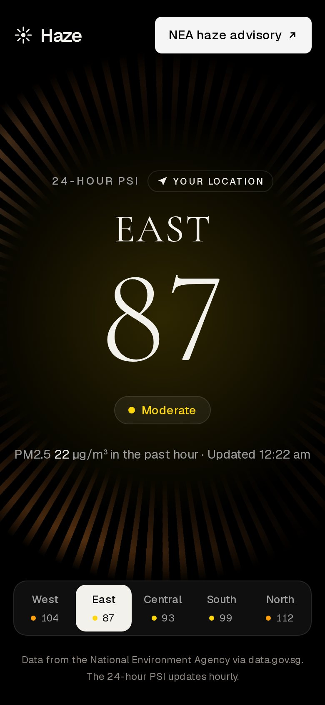
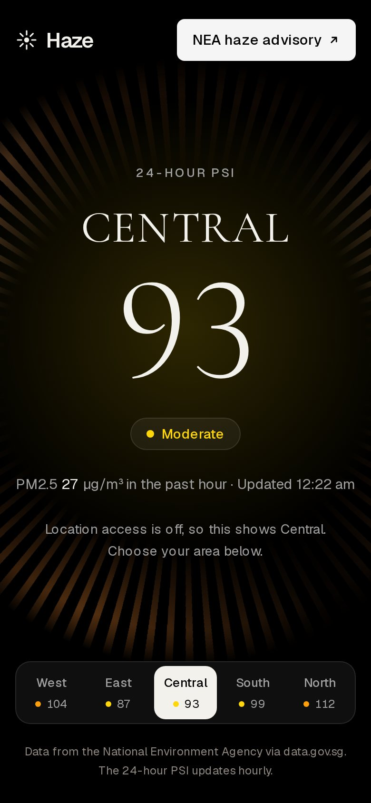
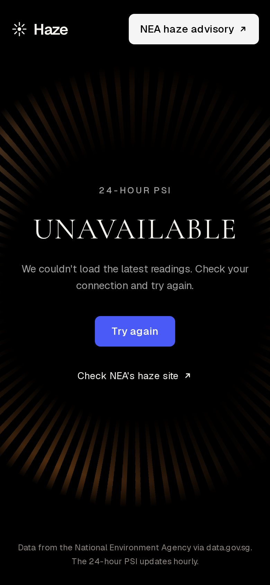
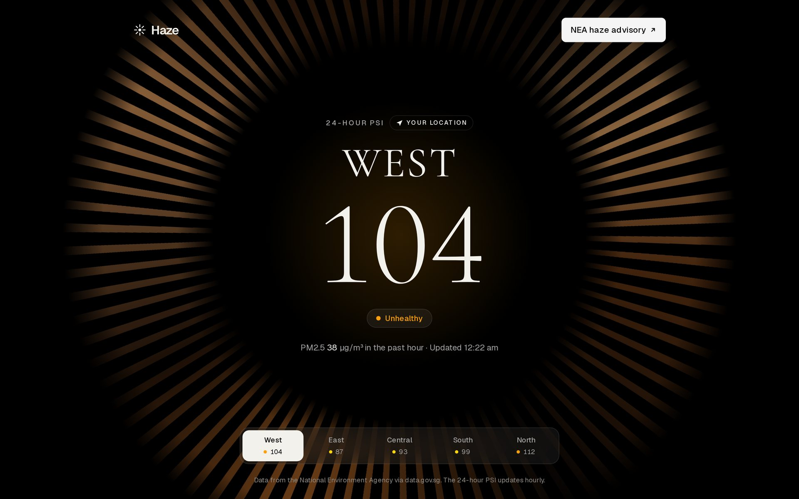

# Haze · Singapore PSI

A one-screen web app that shows Singapore's 24-hour PSI for where you are right now, and lets you switch to any other region in one tap. It reads NEA data from data.gov.sg, needs no database or login, and is built to load fast on a phone.

<p>
  
  
  
</p>


## What it does

- Asks for the browser's location and shows the 24-hour PSI for the nearest of the five regions, with a "Your location" tag.
- Region tabs (West, East, Central, South, North) swap the reading instantly from data already loaded, with arrow-key support.
- Falls back to Central, with a one-line reason, when location is denied, times out, is unsupported or is outside Singapore.
- Shows the band as text and colour using NEA ranges: 0–50 Good, 51–100 Moderate, 101–200 Unhealthy, 201–300 Very unhealthy, above 300 Hazardous.
- Shows the one-hour PM2.5 and the reading time in Singapore time.
- Labels data as "May be outdated" when the server is serving its last good copy or the reading is more than two hours old.
- Remembers the last region on the device, refreshes quietly when you return to the tab after five minutes, and links to NEA's haze site for official advice.

## How the data flows

```
Browser ──► /api/psi (Next.js route) ──► data.gov.sg  /v2/real-time/api/psi
   │            │  fetch cache: 5 min                 /v2/real-time/api/pm25
   │            │  lastGood copy if upstream fails
   │            └─ Cache-Control: s-maxage=300, stale-while-revalidate=600
   └─ picks the nearest region itself, so coordinates never leave the device
```

| Layer                                            | Where                       | Lifetime                                                              | Purpose                                                                    |
| ------------------------------------------------ | --------------------------- | --------------------------------------------------------------------- | -------------------------------------------------------------------------- |
| CDN (`Cache-Control`)                            | Host edge                   | 5 min, then stale while refreshing (1 min when serving fallback data) | Answer without reaching the app                                            |
| Next.js data cache (`next: { revalidate: 300 }`) | Server                      | 5 min                                                                 | Keeps data.gov.sg to about 12 calls an hour; only 200 responses are stored |
| `lastGood`                                       | Server memory, per instance | Until restart                                                         | Served with `stale: true` if data.gov.sg errors or rate-limits             |

If there is no data at all the route returns `502` with `Cache-Control: no-store`, and the page shows an error with a retry button.

## Getting started

Requires Node 22.

```bash
npm install
npm run dev          # http://localhost:3000
```

Optionally add a data.gov.sg API key for higher rate limits. It is read on the server only:

```bash
cp .env.example .env.local   # then set DATAGOV_KEY
```

## Scripts

| Command                       | What it does                                                                                               |
| ----------------------------- | ---------------------------------------------------------------------------------------------------------- |
| `npm run dev`                 | Development server                                                                                         |
| `npm run build` / `npm start` | Production build and server                                                                                |
| `npm run lint`                | ESLint                                                                                                     |
| `npm run typecheck`           | Generates Next.js route types, then `tsc --noEmit`                                                         |
| `npm test`                    | Unit and component tests (Vitest, React Testing Library, jsdom)                                            |
| `npm run test:e2e`            | Playwright on mobile and desktop Chromium, including an axe accessibility scan. Run `npm run build` first. |
| `npm run test:live`           | Calls the real data.gov.sg API and checks the parser still understands it                                  |
| `npm run format`              | Prettier                                                                                                   |

## Project layout

```
app/
  api/psi/route.ts     Server route: fetch, cache headers, 502 fallback
  layout.tsx           Fonts (Cormorant Garamond display, SF Pro or Geist body) and metadata
  page.tsx             Header plus the client app
components/            Headline, region tabs, location note, loading and error states
hooks/
  use-psi-data.ts      Loads /api/psi, retry, background refresh
  use-region-choice.ts Geolocation, remembered region and manual choice
lib/
  constants.ts         URLs, cache timings, thresholds
  psi/                 Types, bands, regions and distance, upstream parser, source with lastGood
  format.ts            Singapore-time formatting
tests/                 Vitest unit and component tests, fixtures and the live API check
e2e/                   Playwright tests
```

## Design

The look takes its cues from a dark, editorial finance site: black background, warm ivory text (`#F3F1EC`), grey letter-spaced labels (`#A0A0A0`), a copper louvre ring around the reading, and a blue call to action (`#4A5AF6`). Region names and the reading use Cormorant Garamond; body text uses the system font, so Apple devices get SF Pro and everything else gets Geist. Band colours are Apple's dark-mode system colours. All tokens live at the top of `app/globals.css`.

## Notes

- The API response shape is modelled on data.gov.sg's v2 real-time API (`data.items[0].readings.psi_twenty_four_hourly`, `pm25_one_hourly` and `data.regionMetadata[].labelLocation`). The parser tolerates missing regions, a `national` key and missing metadata. CI runs `npm run test:live` as a non-blocking check that logs the real response keys.
- The product name is set in `APP_NAME` in `lib/constants.ts`.
